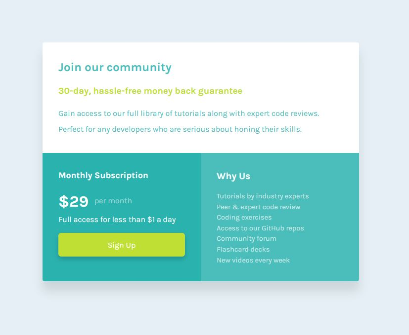

# Frontend Mentor - Single price grid component solution

This is a solution to the [Single price grid component challenge on Frontend Mentor](https://www.frontendmentor.io/challenges/single-price-grid-component-5ce41129d0ff452fec5abbbc). Frontend Mentor challenges help you improve your coding skills by building realistic projects. 

## Table of contents

- [Overview](#overview)
  - [The challenge](#the-challenge)
  - [Screenshot](#screenshot)
  - [Links](#links)
- [My process](#my-process)
  - [Built with](#built-with)
  - [What I learned](#what-i-learned)
- [Author](#author)

## Overview

### The challenge

Users should be able to:

- View the optimal layout for the component depending on their device's screen size
- See a hover state on desktop for the Sign Up call-to-action

### Screenshot

### Links

- Solution URL: [https://github.com/Robert-Rynard/single-price-grid-component-main](https://github.com/Robert-Rynard/single-price-grid-component-main)
- Live Site URL: [https://robert-rynard.github.io/single-price-grid-component-main/](https://robert-rynard.github.io/single-price-grid-component-main/)

## My process

### Built with

- Semantic HTML5 markup
- CSS custom properties
- Flexbox
- CSS Grid
- Mobile-first workflow

### What I learned

In this challenge I used CSS Grid and Flexbox to create a responsive layout. This challenge gave me a better grasp of the strengths and weakness of using grid or flexbox and the ways in which they can work together to create beautiful responsive web pages.

## Author

- Website - [Robert Rynard](https://github.com/Robert-Rynard)
- Frontend Mentor - [@Robert-Rynard](https://www.frontendmentor.io/profile/Robert-Rynard)
- Twitter - [@robert_rynard](https://www.twitter.com/robert_rynard)
